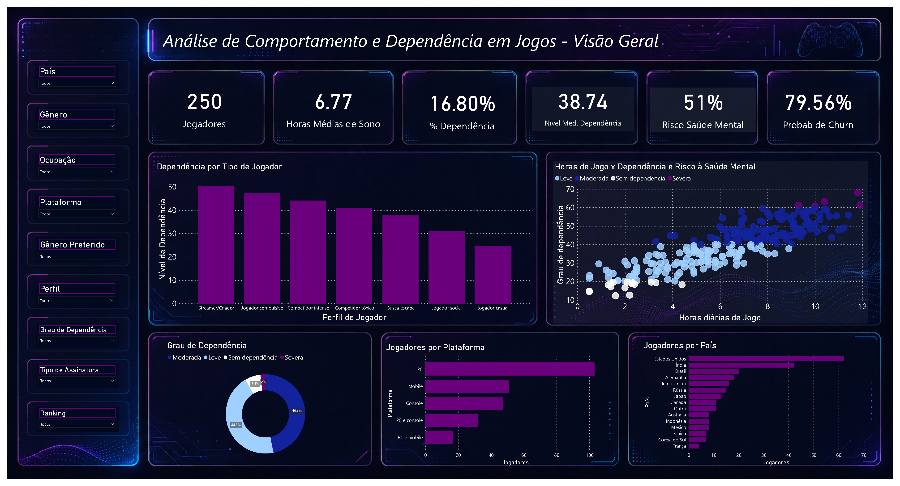
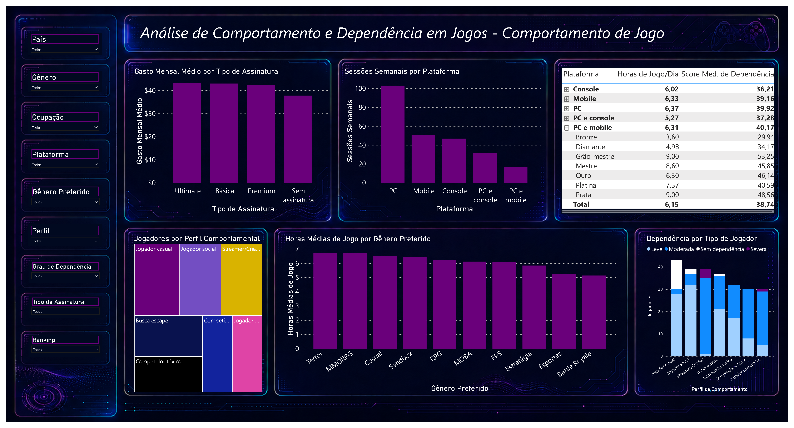
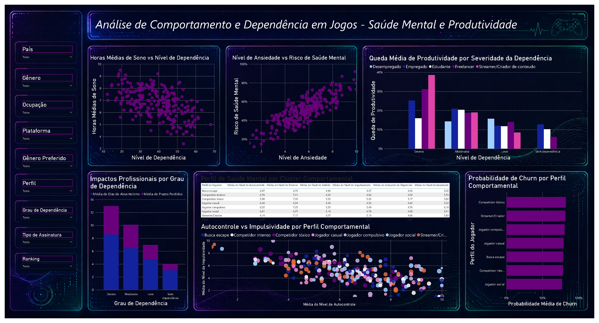

# Gaming and Mental Health Analysis

Projeto de análise de dados sobre comportamento em jogos, dependência, saúde mental e produtividade, com tratamento em Python e visualização final em Power BI.

## Sobre o projeto

A ideia deste projeto foi pegar um dataset público sobre hábitos de jogo e transformá-lo em uma análise visual mais clara, com uma narrativa que conectasse comportamento, risco de dependência, sono, ansiedade, produtividade e churn.

O fluxo passa por preparação dos dados em Python, padronização das variáveis, tratamento de valores ausentes, tradução das categorias para português e construção de um dashboard interativo no Power BI.

O dataset original está disponível no Kaggle: [Gaming Addiction and Mental Health Analysis](https://www.kaggle.com/datasets/dreamtensor/gaming-addiction-and-mental-health-analysis).

## O que a análise mostrou

A relação mais forte do projeto aparece entre tempo diário de jogo e score de dependência. Na base analisada, a correlação entre essas duas variáveis é de 0,861, indicando que jogadores que passam mais horas jogando tendem a aparecer com scores maiores de dependência.

Também fica bem clara a diferença entre os grupos de severidade. Jogadores sem dependência jogam, em média, 2,02 horas por dia e dormem 7,70 horas. Já os jogadores com dependência severa jogam 10,68 horas por dia e dormem 5,84 horas. Isso ajuda a mostrar como o excesso de jogo aparece acompanhado por uma rotina de sono pior.

Outro ponto forte da análise é a relação entre ansiedade e risco de saúde mental. A correlação entre nível de ansiedade e score de risco de saúde mental é de 0,817, uma das maiores do estudo.

A dependência também aparece associada a impactos práticos na rotina. No grupo com dependência severa, a queda média de produtividade é de 28,38%, com 8,60 dias médios de absenteísmo e 4,40 prazos perdidos. Entre jogadores sem dependência, esses valores caem para 9,31%, 3,06 dias e 0,94 prazo perdido.

Os perfis comportamentais com maior score médio de dependência são `Streamer/Criador`, com 50,43, `Jogador compulsivo`, com 47,38, e `Competidor intenso`, com 44,08. O perfil `Jogador casual` aparece com o menor score médio, 24,70.

Em resumo, os recortes que mais ajudam a contar a história do projeto são intensidade de jogo, severidade da dependência, sono, ansiedade e produtividade.

## Indicadores gerais

- Jogadores analisados: 250
- Dependência binária observada: 16,80%
- Horas diárias médias de jogo: 6,15
- Horas médias de sono: 6,77
- Score médio de dependência: 38,74
- Risco médio de saúde mental: 51%
- Probabilidade média de churn: 79,56%

## Dashboard

O relatório foi organizado em três páginas no Power BI.

### Visão geral



A primeira página reúne os principais indicadores e dá uma visão rápida da base, com filtros por país, gênero, ocupação, plataforma, gênero preferido, perfil, grau de dependência, assinatura e ranking.

### Comportamento de jogo



A segunda página olha para padrões de uso, gasto, plataforma, sessões semanais, gênero preferido e perfis comportamentais. Ela ajuda a entender como diferentes grupos jogam e gastam.

### Saúde mental e produtividade



A terceira página conecta o comportamento de jogo com saúde mental e produtividade, destacando sono, ansiedade, risco de saúde mental, autocontrole, impulsividade, absenteísmo, prazos perdidos e churn.

## Como os dados foram preparados

A base bruta possui 250 linhas e 49 colunas. Depois do tratamento, a base final fica com 250 linhas e 50 colunas, sem valores nulos, com nomes de colunas em português e um `id_usuario` numérico sequencial.

O identificador original do dataset foi preservado em `id_usuario_original`, o que permite usar um ID simples no Power BI sem perder a rastreabilidade da base original.

O pré-processamento inclui:

1. Tratamento de valores ausentes.
2. Normalização de categorias.
3. Tradução de colunas e valores categóricos.
4. Criação de um ID numérico sequencial.
5. Exportação para CSV e XLSX.

## Tecnologias usadas

- Python
- pandas
- kagglehub
- Plotly Express
- Jupyter Notebook
- Power BI

## Como executar

Crie e ative um ambiente virtual:

```powershell
python -m venv venv
.\venv\Scripts\Activate.ps1
```

Instale as dependências:

```powershell
pip install -r requirements.txt
```

Abra o notebook:

```powershell
jupyter notebook notebooks/preprocessed.ipynb
```

Depois de executar as células, os arquivos processados serão salvos em `data/processed/`.

Para abrir o dashboard no Power BI Desktop:

```text
reports/gaming-and-mental-health-report.pbix
```

A versão em PDF está em:

```text
reports/pdf/gaming-and-mental-health-report.pdf
```

## Observações

As conclusões foram calculadas a partir da base processada em `data/processed/gaming_addiction_preprocessed.csv`.

As imagens usadas neste README são prints das páginas finais do relatório e estão na pasta `figures/`.

As relações encontradas indicam associações dentro deste dataset, não causalidade. Para uma análise estatística mais profunda, o ideal é preservar as colunas decimais como numéricas e expandir os testes exploratórios.
